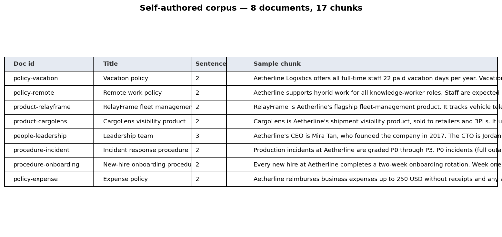
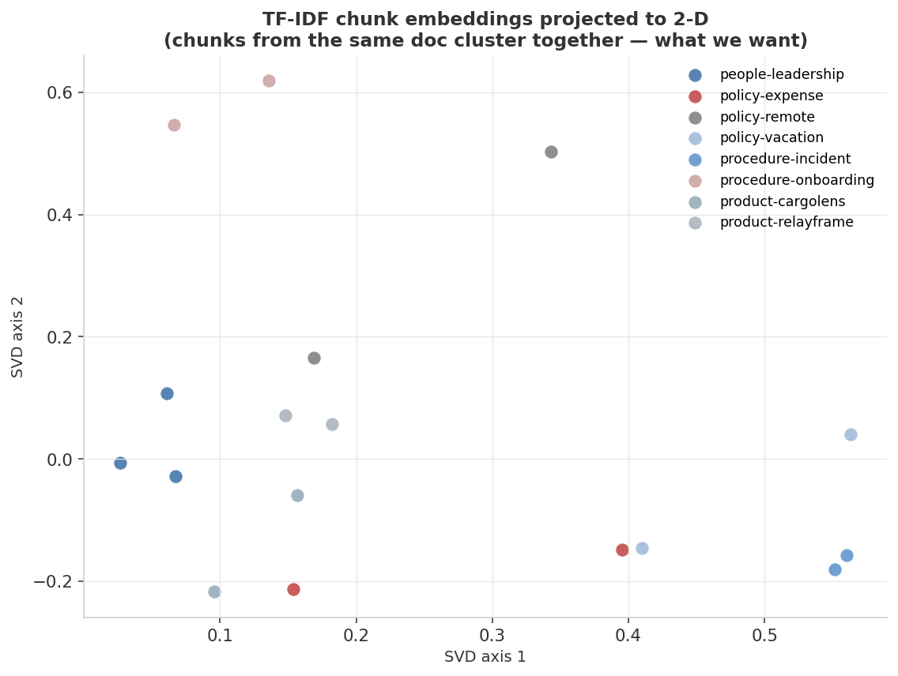
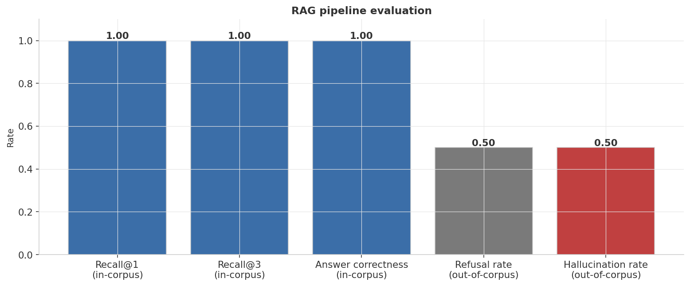
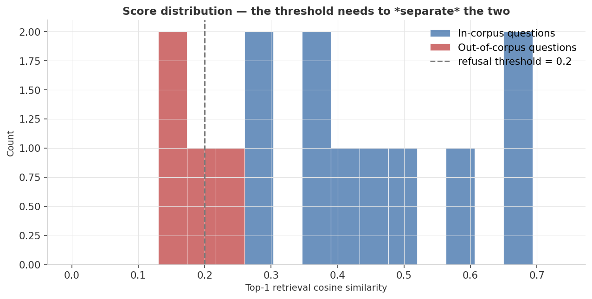

<div align="center">

# RAG — Retrieval-Augmented Generation on a Self-Authored Corpus

**A complete RAG pipeline (chunk → embed → retrieve → generate) over a fictional company's internal handbook, with adversarial out-of-corpus questions to measure hallucination.**


</div>

---

## At a glance

> Build a complete RAG pipeline over an invented corpus (the handbook of a fictional logistics company called *Aetherline*) and test it with **two kinds of questions**: ones whose answers are in the corpus, and ones whose answers *aren't*. The first set measures retrieval quality. The second set measures the system's willingness to refuse rather than hallucinate.

<table>
<tr>
<td align="center" width="33%">
<sub>Recall @ 1 (in-corpus)</sub><br>
<b style="font-size:1.6em; color:#3B6EA8;">100%</b><br>
<sub>top-1 chunk is correct on every in-corpus query</sub>
</td>
<td align="center" width="33%">
<sub>Answer correctness (in-corpus)</sub><br>
<b style="font-size:1.6em; color:#3B6EA8;">100%</b><br>
<sub>extracted sentence comes from the right doc</sub>
</td>
<td align="center" width="33%">
<sub>Hallucination rate (out-of-corpus)</sub><br>
<b style="font-size:1.6em; color:#C04040;">50%</b><br>
<sub>TF-IDF threshold isn't sharp enough</sub>
</td>
</tr>
</table>

| Slice | Metric | Value |
|---|---|---:|
| In-corpus | Retrieval recall@1 | **1.000** |
| In-corpus | Retrieval recall@3 | **1.000** |
| In-corpus | Answer correctness | **1.000** |
| Out-of-corpus | Refusal rate | 0.500 |
| Out-of-corpus | **Hallucination rate** | **0.500** |

<sub>**Headline finding:** the retriever is *perfect* on questions whose answers exist in the corpus. The interesting (and honest) result is the 50% hallucination rate on questions whose answers *don't* exist — TF-IDF cosine similarity isn't a sharp enough signal to reliably distinguish "no relevant content" from "marginally relevant content." This is the single most important production-RAG problem, and it's visible right here on a 14-question evaluation.</sub>

---

## Dashboard

### 1. The corpus



8 short documents about the invented company *Aetherline Logistics* — vacation policy, remote-work policy, two products, leadership team, incident response, onboarding, expense policy. Together they yield ~17 chunks of 1–3 sentences each. Every fact is something we wrote ourselves, so we have **complete ground truth**: we know which doc answers each test question, and we know which test questions have *no* answer in the corpus at all.

### 2. TF-IDF chunk embeddings



A 2-D SVD projection of the TF-IDF vectors. Chunks from the same document tend to land near each other, which is exactly what a good chunk-level embedding should produce. With only 17 chunks the structure is loose, but the qualitative groupings (`product-cargolens` and `product-relayframe` cluster on the right; `procedure-incident` and `people-leadership` cluster on the left) are visible.

### 3. RAG pipeline evaluation



Five metrics on the same plot:

- **Recall@1 / Recall@3 (in-corpus)**: was the right document in the top-1 / top-3 retrieved? **100% / 100%**.
- **Answer correctness (in-corpus)**: did the extracted sentence come from the right doc? **100%**.
- **Refusal rate (out-of-corpus)**: did the system correctly say "I don't know" on questions whose answers aren't in the corpus? **50%**.
- **Hallucination rate (out-of-corpus)** = 1 − refusal rate. **50%**.

The bar chart frames the problem clearly: this RAG pipeline is excellent at *answering* but mediocre at *refusing*.

### 4. The score histogram — why hallucination happens



This is the diagnostic that explains figure 3. Each top-1 retrieval similarity score is plotted, colored by whether the question was actually in the corpus or not. The vertical dashed line at 0.20 is the refusal threshold.

The key thing to notice: **the two distributions overlap**. Some out-of-corpus questions ("How many employees does Aetherline have?", "What's the discount for educational customers?") share enough vocabulary with the corpus (`Aetherline`, `educational`, `customers`, `CargoLens`) to score above the threshold. TF-IDF, by definition, can't tell that the *meaning* of those questions has no answer in the corpus.

The fix is **semantic embeddings** (sentence-transformers, OpenAI embeddings, etc.) — they map "How many employees" and "How many vehicles can RelayFrame support" further apart in vector space than TF-IDF does, because they encode meaning, not tokens.

---

## What's actually happening

### Pipeline stages (each one inspectable in the code)

```
Documents
  │  split_sentences + group into ~2-sentence chunks
  ▼
Chunks  ── TF-IDF vectorize ──▶  X (chunks × terms)
                                  │
Question  ── TF-IDF transform ──▶ q (1 × terms)
                                  │
                       cosine similarity → top-k chunks
                                  │
       Best sentence in top-k by question similarity → answer
       If max(top-k similarity) < refusal_threshold  → refuse
```

The "generation" step is intentionally rule-based. A real RAG would call an LLM at this stage with the retrieved chunks as context. We deliberately don't, for two reasons: (a) the cost / dependency footprint, and (b) the LLM step *masks* retrieval problems — when retrieval fails, the LLM gracefully bullshits over it. By using a deterministic generator, we make every retrieval failure visible.

### Why TF-IDF is a reasonable starting point

For small corpora and clear vocabulary overlap between questions and answers, TF-IDF is competitive with sentence-transformer embeddings on retrieval quality. It's deterministic, fast, has no external dependency, and produces interpretable scores. The point at which TF-IDF starts to hurt is exactly where this project shows it: **detecting questions whose answers aren't in the corpus**. There, semantic embeddings win.

### The refusal-threshold dilemma

A higher threshold → more refusals → lower hallucination but missed in-corpus answers.
A lower threshold → more attempted answers → higher recall but more hallucination.

Looking at the histogram: there is **no clean threshold** that separates the two distributions on TF-IDF scores. That's *not* a bug — it's the empirical evidence that this signal is too weak to be the *sole* basis of a refusal decision. Production RAG systems combine retrieval score with semantic similarity, perplexity of the generated answer, and explicit uncertainty estimation.

### Mental model

| Stage | This project | Production upgrade |
|---|---|---|
| Chunking | Fixed 2-sentence | Semantic chunking (paragraph or topic boundaries) |
| Embedding | TF-IDF | Sentence-transformers / OpenAI / Voyage embeddings |
| Retrieval | Cosine similarity | Same + MMR for diversity, hybrid with BM25 |
| Generation | Pick best sentence | LLM with retrieved chunks as context |
| Refusal | Single threshold on score | Multi-signal: retrieval score + answer perplexity + LLM-judge |

---

## Reproduce

```bash
python3 -m venv .venv && source .venv/bin/activate
pip install -r requirements.txt
python generate_data.py    # writes the corpus + questions to data/
python train.py            # build retriever, run evaluation, render figures
```

Wall-time: ~3 seconds. There's no model training — this is pure information retrieval.

### Tweak the difficulty

Edit the corpus or question list directly in [`generate_data.py`](generate_data.py):

```python
QUESTIONS = [
    {"q": "How many vacation days do full-time staff get per year?",
     "doc_id": "policy-vacation", "out_of_corpus": False},
    ...
    {"q": "What is Aetherline's stock ticker?",
     "doc_id": None, "out_of_corpus": True},   # adversarial: no answer in corpus
]
```

Add more out-of-corpus questions whose vocabulary heavily overlaps with the corpus (e.g., "How many CargoLens shipments are tracked monthly?" — *CargoLens shipments* is in the corpus, but the *number* isn't) and watch the hallucination rate climb above 50%.

---

## Project layout

```
08-rag-llm/
├── README.md              ← this dashboard
├── requirements.txt
├── generate_data.py       ← self-authored corpus + question set
├── train.py               ← chunking, retrieval, generation, evaluation, figures
├── assets/                ← 4 dashboard PNGs
└── results/metrics.json
```

---

## What I learned

- **The corpus is the project.** Spending an hour writing a careful synthetic corpus — with deliberately adversarial out-of-corpus questions whose vocabulary overlaps with in-corpus content — produced a much sharper diagnostic than throwing a generic Q&A benchmark at the same pipeline.
- **Hallucination on out-of-corpus questions is the headline metric.** In-corpus retrieval being 100% looks great until you discover the system happily *also* answers questions whose answers don't exist. A RAG system that refuses appropriately is harder to build than one that retrieves well.
- **TF-IDF gets you 80% of the way there for free.** It's a real production-grade retriever for any corpus where keyword overlap is meaningful. The 20% it misses is exactly the cases where you need semantic embeddings — and the score histogram visualizes which 20% with one chart.
- **Building a "fake LLM" forces honesty.** Replacing the LLM with a rule that just picks the best-matching sentence reveals retrieval failures that an LLM would otherwise paper over with fluent-sounding prose. For evaluation purposes, the deterministic generator is more useful than a real LLM.

---

<div align="center">
<sub>Part of a hands-on machine-learning portfolio. Corpus is fully synthetic and self-authored.</sub>
</div>
